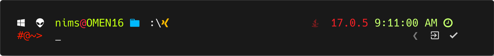

<!--  -->

- 🧑‍💻 I’m an Engineering Undergraduate with 1+ years industry experiance...
- 🌱 I’m currently learning everything ...
- 🙋‍♂️ I’m looking to collaborate with other developers ...

### 📫 How to reach me ...

[][twitter]
[][linkedin]
[][email]
[][instagram]
[][facebook]

### 💻 Tech Stack ...

 
 
 
 
 
 
 
 
 
 
 
 
  
 

  
   
  
  

  
📊 Github Stats

  
   
  
  

  

  

  
🗠 Top Languages

  
   
  
  
  
 

    
  

  
⌛ Wakatime Week Stats

  
   
  
  

<!---
NimsHub/NimsHub is a ✨ special ✨ repository because its `README.md` (this file) appears on your GitHub profile.
You can click the Preview link to take a look at your changes.
--->
[twitter]: https://twitter.com/Nims_9T8
[instagram]: https://www.instagram.com/mad_nirmala/
[linkedin]: https://www.linkedin.com/in/nirmala-sabaragamuwa
[facebook]: https://www.facebook.com/nirmala.madhusankha.1/
[whatsapp]: https://wa.me/94719629058
[email]: mailto:nirmalasabaragamuwa@gmail.com
[vscode]: https://code.visualstudio.com/
[intellij]: https://www.jetbrains.com/idea/
[html]: https://www.w3schools.com/html/
[css]: https://www.w3schools.com/css/
[js]: https://www.w3schools.com/js/
[Java]:https://www.w3schools.com/java/
[react]: https://reactjs.org/docs/getting-started.html
[node]: https://nodejs.org/dist/latest-v14.x/docs/api/
[spring]:https://docs.spring.io/spring-framework/docs/current/reference/html/
[mongodb]: https://docs.mongodb.com/manual/
[git]: https://git-scm.com/doc
[github]: https://github.com/NimsHub
[terminal]: https://www.microsoft.com/en-us/p/windows-terminal/9n0dx20hk701
[Mariadb]:https://mariadb.org/documentation/
